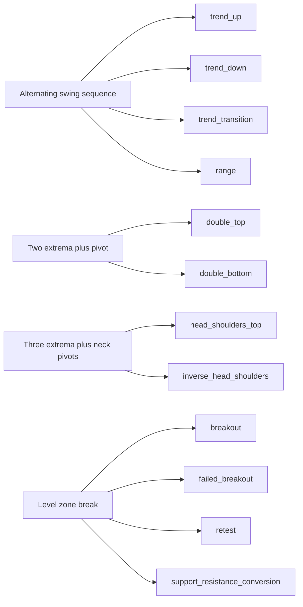

# MG1-A Pattern Ontology Review Draft

Decision: `DRAFT_NEEDS_HUMAN_FREEZE`

This document is a parameterized vocabulary for human review. It is not a
frozen ontology, detector, labeler, trading rule, or model specification. A
domain expert must approve every family definition, phase rule, anchor role,
confirmation rule, and invalidation rule before MG1-B may treat it as source of
truth.

## Evidence Observed

- The MG1-A task specification fixes 12 initial families, eight common phases,
  scale-normalized fields, three separate label namespaces, and the draft-only
  decision.
- The technical report requires the same family topology to work at multiple
  scales and requires online phase, retrospective completion, and future
  outcome to remain separate.
- The Chendage swing implementation compares each candidate extreme with bars
  on both sides. Its event timestamp is therefore earlier than the timestamp at
  which the swing becomes available. The draft adds both `event_eob` and
  `available_as_of_eob`.
- The Chendage support/resistance implementation provides useful role names,
  including converted support and resistance, but uses absolute point buffers.
  Those buffers are not adopted because the ontology core requires normalized
  units.
- The Chendage trend implementation provides swing-order terminology, but its
  fixed lookback, minimum swing count, confidence values, and range fallback are
  not adopted as ontology definitions.
- `/home/v/Downloads/chen` requires a full global-order reading and explicit
  conflict handling. That large review was not performed in MG1-A. Search hits
  from that material are not definition evidence.
- Every evidence record binds the observed file bytes by SHA256. The task
  specification, technical report, and repository implementation evidence are
  required. External implementation references are verified when available and
  reported unavailable otherwise.

## Scope Boundary

The YAML contract describes family topology, symbolic parameter references,
normalized field names, lifecycle mappings, causal observation fields, and
assumption provenance. It deliberately contains no numeric detector threshold,
absolute price threshold, return claim, or trading action.

No real-data labels or synthetic samples were created. No detector, labeler,
training, JAX computation, or GPU operation was executed.

## Glossary

| Term | Draft meaning |
|---|---|
| family | A scale-independent topology vocabulary such as `double_top`; not a detector result. |
| allowed_instance_sides | The exact structural sides an instance of a family may bind. |
| instance_side_basis | The anchor relation that determines an instance side; it is not a trade direction. |
| scale_id | Instance-supplied scale identity. It does not control whether a family exists. |
| base_timeframe | Instance metadata used to interpret timestamps; not a family enum. |
| anchor role | A named structural role in a family topology. Cardinality and extraction remain under review. |
| event_eob | End-of-bar timestamp at which the structural event occurred. |
| available_as_of_eob | First timestamp at which the anchor can be known under its source method. |
| normalized_price | Price displacement expressed in a train-frozen scale unit, never a core absolute threshold. |
| topology constraint | A symbolic relation among anchor roles. Parameter references have no value in MG1-A. |
| online causal phase | A phase derived only from information available through the observation timestamp. |
| retrospective completion | A target-only statement about whether an earlier candidate eventually completed. |
| future outcome | A target-only post-confirmation path label, separate from pattern completion. |
| optional confirmation | Volume or open-interest evidence that cannot define whether topology exists. |
| assumption_id | A fail-closed reference to an unresolved expert decision. |
| review draft | A contract that validates structurally while remaining explicitly unfrozen. |

## Common Instance Contract

Every future instance must preserve these independent timestamps:

```text
anchor.event_eob <= anchor.available_as_of_eob <= observation.as_of_eob
```

The final inequality is required before an anchor may support an online phase.
The instance also records `source_bar_closed`, `session_calendar_version`,
`active_contract`, and `roll_state`. These fields prevent a revisable aggregate
bar, incomplete calendar, or silent contract roll from being mistaken for a
stable structural event.

Every instance `side` must belong to its family's `allowed_instance_sides`.
`INSTANCE_PARAMETER` is a family-definition placeholder and is never an
instance value. The instance also carries `normalized_geometry`,
`duration_ratios`, and `price_ratios`; their keys are declared by the bound
family, while all values and missingness policies remain subject to review.

## Normalization Contract

Price geometry may use `ATR_MULTIPLE`, `REALIZED_VOL_MULTIPLE`,
`TRAIN_FROZEN_SCALE_MULTIPLE`, or `DIMENSIONLESS_RATIO`. The expert must select
the method and the train-only fitting boundary. Durations use
`SCALE_WINDOW_STATISTIC_RATIO`. The ontology core forbids absolute price
thresholds.

The same family definition is serialized at every scale. A bound instance adds
`scale_id` and `base_timeframe`; these bindings do not change the family
definition hash. Scale-specific noise tolerance, minimum duration, and optional
filter strength remain unresolved parameter references.

## Label Namespace Separation

| Namespace | Information boundary | Runtime input | Purpose |
|---|---|---:|---|
| `online_causal_phase` | Prefix through `as_of_eob` | forbidden | Causal current-state output or target, not a raw runtime input. |
| `retrospective_completion` | Future allowed, target only | forbidden | Whether a prior candidate eventually completed. |
| `future_outcome` | Post-confirmation future, target only | forbidden | Future path target after confirmation. |

These namespaces must remain separate objects or tables. Flattening them into a
single runtime row is rejected because it can leak future information.

## Family-to-Anchor Diagrams

All paths below are proposed role orderings, not approved geometry. Optional
roles appear in brackets. Every path is governed by its family `STRUCTURE`
assumption and the common anchor-causality assumptions.

| Family | Proposed anchor path |
|---|---|
| `trend_up` | `trend_origin_low -> (swing_high <-> pullback_low)+ -> current_frontier` |
| `trend_down` | `trend_origin_high -> (swing_low <-> reaction_high)+ -> current_frontier` |
| `trend_transition` | `prior_sequence_terminal_extreme -> last_defending_pivot -> structure_break -> first_counter_pivot -> [transition_retest]` |
| `double_top` | `left_peak -> intervening_trough -> right_peak -> neckline_zone -> [break] -> [retest]` |
| `double_bottom` | `left_trough -> intervening_peak -> right_trough -> neckline_zone -> [break] -> [retest]` |
| `head_shoulders_top` | `left_shoulder_peak -> left_neck_trough -> head_peak -> right_neck_trough -> right_shoulder_peak -> neckline_segment -> [neckline_break]` |
| `inverse_head_shoulders` | `left_shoulder_trough -> left_neck_peak -> head_trough -> right_neck_peak -> right_shoulder_trough -> neckline_segment -> [neckline_break]` |
| `breakout` | `reference_level_anchor -> reference_zone -> approach_leg_start -> boundary_cross -> [post_cross_hold] -> [retest_touch]` |
| `failed_breakout` | `reference_level_anchor -> reference_zone -> attempt_cross -> max_outside_excursion -> boundary_reentry -> [inside_rejection]` |
| `retest` | `source_event_ref -> converted_boundary_zone -> origin_break -> post_break_extreme -> return_touch -> [hold_or_rejection] -> [continuation_anchor]` |
| `range` | `(upper_boundary_touch <-> lower_boundary_touch)+ -> upper_boundary_zone/lower_boundary_zone -> current_frontier` |
| `support_resistance_conversion` | `original_level_anchor -> original_level_zone -> role_break -> post_break_extreme -> opposite_side_return -> [converted_role_hold_or_rejection]` |

The following Mermaid view groups the reusable topology templates:



Detailed role relations are parameterized in
`configs/market_genome/pattern_ontology_v1.yaml`. Mirrored families share field
shape in this draft, but the draft does not assume bullish and bearish
parameters or statistics are symmetric.

The draft makes three previously implicit relations explicit: a trend
transition's `structure_break` crosses `last_defending_pivot`; a top head lies
above both shoulder peaks and those shoulders are level-compatible; the inverse
relations hold for the trough form. Compatibility tolerances remain unresolved
parameter references, not numeric definitions.

## Phase Transition Tables

### Common phase semantics

| Phase | Draft contract meaning | Expert decision still required |
|---|---|---|
| `INACTIVE` | No active object under the family contract. | Reset and overlap policy. |
| `CANDIDATE` | Earliest causal anchor evidence is available. | Minimum evidence and anchor cardinality. |
| `DEVELOPING` | Additional causal roles or relations are observed. | Required relations and expiry. |
| `MATURE` | Proposed topology is sufficiently formed for review. | Geometry and maturity criteria. |
| `CONFIRMED` | Family-specific causal confirmation is observed. | Exact confirmation event and threshold policy. |
| `RETEST_OR_CONTINUATION` | A post-confirmation causal structural state is observed. | Optionality and family-specific mapping. |
| `COMPLETED` | Online lifecycle is closed without implying a profitable outcome. | Completion timing and terminal behavior. |
| `INVALIDATED` | A causal invalidation condition is observed. | Family-specific invalidation and expiry. |

### Declared common transitions

| From | Allowed next phase(s) |
|---|---|
| `INACTIVE` | `CANDIDATE` |
| `CANDIDATE` | `DEVELOPING`, `INVALIDATED` |
| `DEVELOPING` | `MATURE`, `INVALIDATED` |
| `MATURE` | `CONFIRMED`, `INVALIDATED` |
| `CONFIRMED` | `RETEST_OR_CONTINUATION`, `INVALIDATED` |
| `RETEST_OR_CONTINUATION` | `COMPLETED`, `INVALIDATED` |
| `COMPLETED` | `INACTIVE` |
| `INVALIDATED` | `INACTIVE` |

MG1-A uses an identity mapping from each family phase to the common lifecycle so
that all families serialize consistently. This identity mapping is a review
placeholder. The expert must decide whether trend and range completion, failed
breakout confirmation, and related-family transitions need specialized phase
names or cross-object links.

## Parameterized Family Fields

Every family definition contains:

- structural `family`, a fixed or instance-bound `side`, exact
  `allowed_instance_sides`, `instance_side_basis`, instance-supplied `scale_id`,
  and instance-supplied `base_timeframe`;
- anchor roles, phase contract, and topology relations;
- normalized geometry, duration-ratio, and price-ratio field names;
- prefix-only prior context, online confirmation, and invalidation fields;
- volume/open-interest fields in a separate optional-confirmation object;
- allowed label provenance and explicit assumption IDs.

Topology relations reference symbolic parameters such as
`double_top.peak_compatibility_policy`. No parameter value is supplied. A later
expert-approved freeze must resolve the parameter, define its train-only fitting
boundary where applicable, and record the reviewer decision.

## Open Questions

1. Which anchor source methods are allowed, and when does each source make an
   anchor available online?
2. May an online phase use a revisable partial aggregate bar, or only a closed
   bar?
3. Which session calendar, holiday, missing-bar, and aggregation policy is
   authoritative for each instrument?
4. How are contract rolls, price adjustments, active-contract identity, and
   contract age represented without creating false anchors?
5. Which train-frozen normalizer is selected, and on which train fold is it fit?
6. What are the family-specific anchor cardinalities, topology parameters,
   phase transitions, confirmations, invalidations, and expiry rules?
7. Are breakout, failed breakout, retest, and support/resistance conversion
   separate concurrent objects or phases/links of one object?
8. Which mirrored families share only schema shape, and which may share learned
   parameters after review?
9. Does each proposed `instance_side_basis` match the expert's intended
   structural direction for transition, breakout, retest, and conversion?
10. How are nested and overlapping objects at different scales identified and
   de-duplicated?
11. Are volume/open-interest fields always optional, and how is missing data
    represented without changing topology?
12. What qualifies as `COMPLETED` for persistent trend and range families?
13. Which provenance categories are admissible for independent benchmark truth?

All open questions have corresponding `NEEDS_HUMAN_REVIEW` assumption records
with `proposed_default: null` and `reviewer_decision: null`.

## Rejected Shortcuts

- Copying the existing Chendage trend result as a frozen family definition.
- Backfilling a centered swing to `event_eob` before it was available.
- Reusing absolute-point proximity or break buffers in the ontology core.
- Treating volume or open interest as topology.
- Combining online phase, retrospective completion, and future outcome.
- Binding family existence to fixed timeframe names.
- Treating a conflict in swing direction as a complete range definition.
- Inferring final double-top or head-and-shoulders geometry from swing order.
- Encoding buy/sell decisions, entries, stops, ratings, or return claims.
- Treating an M12 processed-feature contract pass as ontology proof.
- Treating unordered notebook search matches as approved domain rules.

## Validation Command

The authoritative MG1-A validator is the dedicated CPU-only profile:

```bash
PYTHONPATH=src CUDA_VISIBLE_DEVICES='' \
  python -m alphatrade.market_genome.ontology.validation \
  --profile mg1a --generate --strict
```

`ALPHATRADE_RUNS_ROOT` selects the report root when `--reports-dir` is omitted.
Set `CHENDAGE_SIGNAL_ROOT` and `CHEN_REFERENCE_ROOT` to verify the optional
external implementation evidence. The task plan and technical report under
`docs/market_genome/` are required evidence and their recorded SHA256 values
must match. The repository-wide `validate_reports_schema.py` entry point is not
an MG1-A semantic validator and must not be used to assert this milestone.

## Human Review Checklist

- [ ] Confirm the 12-family set, allowed instance sides, and each side basis.
- [ ] Confirm every anchor role, cardinality, source method, and causal
  availability rule.
- [ ] Confirm the common lifecycle and every family-specific phase mapping.
- [ ] Resolve every topology parameter reference without introducing absolute
  price thresholds.
- [ ] Resolve every normalized geometry, duration, and price-ratio policy.
- [ ] Confirm prior-context fields, including session and continuous-contract
  roll semantics.
- [ ] Confirm online confirmation and invalidation rules use prefix-only data.
- [ ] Confirm volume/open-interest filters remain separate from topology and
  define their missingness policy.
- [ ] Confirm online phase, retrospective completion, and future outcome remain
  separate storage namespaces and are not raw runtime inputs.
- [ ] Confirm overlap, nesting, expiry, and identity policy for related and
  multi-scale objects.
- [ ] Confirm provenance policy and independent benchmark truth eligibility.
- [ ] Record reviewer identity, review timestamp, decisions, and the frozen
  artifact hash in a later milestone.

Until every item is resolved and an expert-approved frozen hash exists, the only
valid decision is `DRAFT_NEEDS_HUMAN_FREEZE`.
