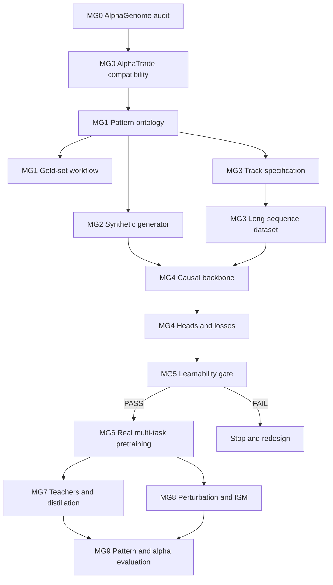

# AlphaTrade MarketGenome 可执行实施方案与 Codex 提示词

**版本**：v0.1  
**日期**：2026-07-13  
**依赖文档**：`AlphaTrade_MarketGenome_Technical_Report.md`  
**当前基线**：AlphaTrade `feature/m12-chendage-features`，M12-CHG formal decision = `FAIL`  
**目标**：把技术方案拆成可验收、可停止、可交给 Codex 独立执行的子任务

---

## 0. 使用方式

本计划不建议一次性把全部提示词交给 Codex。正确节奏是：

```text
下发一个子任务
→ Codex 生成代码、测试和报告
→ 人工 review gate
→ 决定进入下一子任务、返工或停止
```

存在三个必须人工确认的关口：

1. **MG1 Ontology Freeze**：K 线形态定义必须由领域专家批准；
2. **MG5 Learnability Gate**：synthetic 与简单模型都过不了时，禁止进入昂贵真实训练；
3. **MG6 Real-data Gate**：真实 track/pattern benchmark 不通过时，禁止 teachers、distillation 与大模型扩展。

### 0.1 推荐分支策略

从当前稳定分支创建新主线：

```bash
git checkout feature/m12-chendage-features
git pull --ff-only
git checkout -b feature/market-genome-mg0
```

Codex 不得执行 `git reset --hard`、不得删除用户未提交内容。任何任务开始前必须：

```bash
git status --short
git rev-parse HEAD
```

### 0.2 环境与运行根目录

```bash
export RUN="conda run --no-capture-output -n alphatrade_cuda12 env -u LD_LIBRARY_PATH"
export ALPHATRADE_RUNS_ROOT="$(pwd)/../alphatrade_runs/market_genome_<milestone>_$(date +%Y%m%d_%H%M%S)"
export REPORTS="$ALPHATRADE_RUNS_ROOT/reports"
export CHECKPOINTS="$ALPHATRADE_RUNS_ROOT/checkpoints"
export ARTIFACTS="$ALPHATRADE_RUNS_ROOT/artifacts"
```

正式 GPU 路径禁止静默 fallback 到 CPU。若 JAX CUDA 不可用，必须停止并报告。

### 0.3 全局工程约束

所有子任务共同遵守：

- AlphaTrade 仍处开发阶段，不得宣称可交易；
- 保留 M0-M12 现有 API、schemas 和 reports；
- 新代码放入 `src/alphatrade/market_genome/`，不原地重写 `src/alphatrade/core/`；
- 新配置放入 `configs/market_genome/`；
- 新文档放入 `docs/alphaTrade/market_genome/`；
- 新测试放入 `tests/market_genome/` 或当前仓库约定位置；
- 每个里程碑增加独立 schema/profile；
- CI/validator > schema > 文档；
- 配置必须 resolved 后写入 report、artifact 和 hash；
- 任何 target scaler 只用 train split；
- 任何 test split 不得用于 ontology 阈值、loss weight、architecture 或模型选择；
- 未来数据可以作为 target，但绝不能进入 runtime input；
- 所有 causal model 必须通过 prefix/future-mutation invariance；
- 不得把人工 action、评级、teacher outcome 或复盘结果作为 runtime feature。

### 0.4 统一最终回复格式

每个 Codex 子任务的最终回复必须包含：

```text
1. files inspected
2. files changed
3. commands run
4. tests run and results
5. reports/artifacts generated
6. gate status
7. blockers and uncertainties
8. exact recommendation for next task
```

---

## 1. 总体路线图

| 里程碑 | 子任务 | 核心问题 | 进入条件 | 退出 Gate |
|---|---|---|---|---|
| MG0 | AG parity + AT compatibility | 我们是否真正理解 AlphaGenome，当前 repo 如何承接 | M12 closed | 两份 audit 全通过 |
| MG1 | Pattern ontology + gold-set workflow | 什么是跨尺度同构形态及其阶段 | MG0 pass | 领域专家冻结 ontology |
| MG2 | Synthetic generator | 架构可学习的 ground truth 如何生成 | MG1 frozen | synthetic contract pass |
| MG3 | Dense tracks + long-sequence dataset | 如何获得类似 genome tracks 的密集监督 | MG1 frozen | data contract/causality pass |
| MG4 | Causal backbone + heads/losses | 如何实现 MarketGenome MVP | MG2/MG3 ready | architecture tests pass |
| MG5 | Learnability gate | 当前设计是否能学习已知信号 | MG4 ready | synthetic/simple-model gate pass |
| MG6 | Real multi-task pretraining | 真实数据上是否获得可泛化表示 | MG5 pass | fold benchmark pass |
| MG7 | Teachers + distillation | ensemble knowledge 是否可压缩 | MG6 pass | distilled student pass |
| MG8 | Perturbation/effect scoring | 模型是否关注正确结构 | MG6 pass | effect benchmark pass |
| MG9 | Pattern effect + alpha evaluation | 是否有可用增量 alpha | MG6/7/8 pass | promote / continue / stop |

### 1.1 依赖图



---

# MG0：研究与代码对齐

## MG0-A：AlphaGenome 官方代码级 Parity Audit

### 目标

逐文件理解 AlphaGenome 官方论文和研究代码，输出 MarketGenome 映射，不写 MarketGenome 模型代码。

### 主要输入

```text
https://github.com/google-deepmind/alphagenome_research
Nature paper: Advancing regulatory variant effect prediction with AlphaGenome
```

### 产物

```text
docs/alphaTrade/market_genome/MG0_ALPHAGENOME_PARITY_AUDIT.md
$REPORTS/mg0_alphagenome_parity_audit.json
$REPORTS/mg0_alphagenome_parity_audit.md
```

### Gate

- encoder、transformer、pair stack、decoder、embeddings、heads、losses、augmentation、folds、teachers、distillation、variant scoring 均有代码证据；
- 每个组件标注 `reuse / causalize / redesign / defer`；
- 不得只总结论文摘要。

### 发给 Codex 的提示词

```text
You are Codex working inside the AlphaTrade repository.

Sprint name:
MG0-A AlphaGenome Official Code Parity Audit

Purpose:
Build a code-level, source-grounded understanding of AlphaGenome before any MarketGenome implementation. This is an audit and design task, not a model implementation task.

Primary sources:
- https://github.com/google-deepmind/alphagenome_research
- Nature paper: Advancing regulatory variant effect prediction with AlphaGenome

Inspect at minimum:
- src/alphagenome_research/model/model.py
- attention.py
- convolutions.py
- embeddings.py
- heads.py
- losses.py
- augmentation.py
- schemas.py
- splicing.py
- dna_model.py
- model tests
- dataset loader / IO paths
- evaluation and variant scoring modules

Hard constraints:
1. Use official AlphaGenome paper/code as source of truth.
2. Do not implement MarketGenome code in this task.
3. Do not infer a component from its name only; cite file, class/function, and behavior.
4. Separate published behavior from your proposed market analogy.
5. Mark uncertain findings as NEEDS_VERIFICATION.
6. Do not claim that DNA and markets are fully isomorphic.

Produce:
- docs/alphaTrade/market_genome/MG0_ALPHAGENOME_PARITY_AUDIT.md
- $REPORTS/mg0_alphagenome_parity_audit.json
- $REPORTS/mg0_alphagenome_parity_audit.md

Required audit sections:
1. Input representation and organism conditioning.
2. Encoder stages, downsampling ratios, convolution blocks, normalization.
3. Transformer tower, attention, pairwise updates, attention bias.
4. Decoder and skip connections.
5. 1D and pairwise embeddings and their resolutions.
6. Every head type, output resolution, target scaling, and loss.
7. Data batch schema and masking.
8. Augmentation.
9. Pretraining fold design.
10. All-fold teacher and distillation design.
11. Variant scoring and in-silico mutagenesis.
12. Published ablations: target resolution, sequence length, modalities, teacher count.
13. Compute assumptions and sequence parallelism.

For every component, include a mapping row:
- AlphaGenome component
- official code evidence
- scientific role
- MarketGenome candidate analogue
- required causal modification
- proposed status: REUSE_PATTERN | CAUSALIZE | REDESIGN | DEFER
- risk
- validation test

Add a machine-readable JSON component map.

Add an explicit list named:
NON_NEGOTIABLE_ALPHA_GENOME_PRINCIPLES
It should contain the research principles that MarketGenome must preserve, such as long context, dense multi-task tracks, held-out evaluation, and effect scoring.

Add another list:
NON_ISOMORPHIC_COMPONENTS
It must include bidirectional sequence context, reverse complement, and any contact-map target without a valid market counterpart.

Schema/profile:
Add an mg0 profile requiring the JSON and markdown report. Do not modify existing M0-M12 profiles.

Acceptance:
- All required source files inspected.
- No implementation code added outside docs/schemas/report tooling.
- JSON validates.
- python src/alphatrade/scripts/validate_reports_schema.py --profile mg0 --strict passes.

Stop after the audit. Do not build the MarketGenome package yet.
```

---

## MG0-B：AlphaTrade Compatibility Audit 与项目脚手架

### 目标

确定哪些 M0-M12 能复用，哪些 current AlphaTrade assumptions 必须隔离；创建新 package scaffold，但不实现完整模型。

### 产物

```text
docs/alphaTrade/market_genome/MG0_ALPHATRADE_COMPATIBILITY_AUDIT.md
src/alphatrade/market_genome/__init__.py
configs/market_genome/
tests/market_genome/
$REPORTS/mg0_alphatrade_compatibility_audit.json/md
```

### 发给 Codex 的提示词

```text
You are Codex working inside AlphaTrade.

Sprint name:
MG0-B AlphaTrade Compatibility Audit + MarketGenome Scaffold

Context:
M12-CHG formal sweep completed with decision FAIL. The engineering/data-contract path is trusted, but processed features did not improve model quality. MarketGenome is a new model line; do not patch the 60-bar AlphaTrade v0.2 model into a long-sequence system in place.

Inspect:
- src/alphatrade/core/model.py
- causal_layers.py
- causal_attention.py
- losses.py
- schemas.py
- train_m4_alphatrade.py
- window_cache.py
- inference.py
- bundle/export scripts
- M8 iteration loop
- M9/M10/M11 evaluators
- contracts_manifest.yaml
- current M12 reports and decision memo

Hard constraints:
1. Preserve current M0-M12 behavior.
2. New code must live under src/alphatrade/market_genome/.
3. Do not implement the full backbone in this task.
4. Do not remove or rename current report fields.
5. Keep M10/M11 metrics reusable where semantically valid.
6. Do not treat M12 schema PASS as model-quality PASS.

Produce:
- docs/alphaTrade/market_genome/MG0_ALPHATRADE_COMPATIBILITY_AUDIT.md
- $REPORTS/mg0_alphatrade_compatibility_audit.json/md
- a minimal package scaffold under src/alphatrade/market_genome/
- configs/market_genome/README.md
- tests/market_genome/__init__.py or repository-equivalent test package

Audit matrix:
For every current subsystem, classify:
- DIRECT_REUSE
- REUSE_WITH_ADAPTER
- ISOLATE
- REPLACE_FOR_MARKETGENOME
- DEFER

Cover:
- data ingestion
- continuous contract mapping
- feature profiles
- window cache
- long-sequence storage
- model config
- training launcher
- checkpointing
- bundle format
- offline inference
- M10/M11 evaluation
- report governance
- resume safety

Explicitly document current assumptions that are incompatible with MarketGenome:
- fixed short lookback
- last-timestep-only readout
- terminal-return-only labels
- fixed-window cache layout
- current quantile head parameterization
- any hard-coded architecture behavior

Create scaffold files only:
- config.py
- schemas.py
- README.md
- placeholder subpackages for ontology, synthetic, datasets, heads, losses, training, perturbation, evaluation

Each placeholder must clearly raise NotImplementedError or remain import-safe; do not add misleading pseudo-implementation.

Add mg0b schema/profile or extend mg0 without changing prior required fields.

Acceptance:
- current test suite remains green
- import alphatrade.market_genome succeeds
- no existing model result changes
- audit identifies exact reuse boundaries
- strict schema validation passes

Stop after scaffold and audit.
```

---

# MG1：跨尺度 K 线形态 Ontology

## MG1-A：Pattern Ontology Draft

### 人工职责

此任务只能生成待审草案。最终 pattern family、phase、anchor、confirmation、invalidation 必须由用户或指定领域专家冻结。

### 产物

```text
docs/alphaTrade/market_genome/MG1_PATTERN_ONTOLOGY.md
src/alphatrade/market_genome/ontology/schema.py
configs/market_genome/pattern_ontology_v1.yaml
$REPORTS/mg1_pattern_ontology.json/md
```

### 发给 Codex 的提示词

```text
You are Codex working inside AlphaTrade MarketGenome.

Sprint name:
MG1-A Multi-Scale K-Line Pattern Ontology Draft

Context:
The domain premise is fixed: trend, double top/bottom, head-and-shoulders/inverse, breakout/failed breakout, retest, and support-resistance structures can occur at every timeframe. A timeframe changes scale/noise/statistics, not the existence of the pattern family.

Reference materials:
- approved MarketGenome technical report
- /home/v/Downloads/chen as read-only domain material, if available
- /home/v/Documents/work/chendage-signal-engine as read-only terminology/code reference, if available

This task does not implement trading rules or model training.

Hard constraints:
1. Do not invent final pattern definitions silently.
2. Every ambiguous threshold or phase rule must receive an assumption_id and NEEDS_HUMAN_REVIEW.
3. Separate pattern topology from confirmation filters such as volume/OI.
4. Separate online causal phase, retrospective completion label, and future outcome.
5. The same family schema must support multiple scales.
6. Do not encode profit claims or entry actions.

Initial families:
- trend_up / trend_down / trend_transition
- double_top / double_bottom
- head_shoulders_top / inverse_head_shoulders
- breakout / failed_breakout / retest
- range / support_resistance_conversion

For each family define a parameterized schema, not a hard-coded detector:
- family
- side
- scale_id
- anchor roles
- allowed phase sequence
- topology constraints
- normalized geometry fields
- duration ratios
- price ratios
- prior-context fields
- online confirmation fields
- invalidation fields
- optional volume/OI confirmations
- label provenance
- assumption_ids

Required phase semantics:
- INACTIVE
- CANDIDATE
- DEVELOPING
- MATURE
- CONFIRMED
- RETEST_OR_CONTINUATION
- COMPLETED
- INVALIDATED

A family may specialize these phases, but must map to the common lifecycle.

Normalization requirements:
- prices expressed by ATR/realized-volatility or another train-frozen scale
- durations expressed relative to scale/window statistics
- no absolute price thresholds in the ontology core

Produce:
- configs/market_genome/pattern_ontology_v1.yaml
- src/alphatrade/market_genome/ontology/schema.py
- docs/alphaTrade/market_genome/MG1_PATTERN_ONTOLOGY.md
- $REPORTS/mg1_pattern_ontology.json/md

The report must contain:
- glossary
- family-to-anchor diagrams in text/Mermaid
- phase transition tables
- open questions
- rejected shortcuts
- human review checklist

Tests:
- schema round-trip
- invalid phase transitions rejected
- missing assumption provenance rejected
- scale-independent serialization

Decision field:
DRAFT_NEEDS_HUMAN_FREEZE

Stop after producing the draft. Do not create real-data labels or synthetic samples yet.
```

---

## MG1-B：Ontology Freeze、Gold Set 与标注治理

### 目标

把人工批准后的 ontology 固化；建立 gold-set 格式、review workflow 和一致性指标。

### 发给 Codex 的提示词

```text
You are Codex working inside AlphaTrade MarketGenome.

Sprint name:
MG1-B Ontology Freeze + Gold-Set Annotation Workflow

Prerequisite:
MG1-A ontology draft has been reviewed by the domain expert. Use the approved ontology file as source of truth. Do not alter approved definitions without a new assumption/change record.

Primary objective:
Create a reproducible annotation and review workflow for multi-scale K-line patterns. This is label governance, not model training.

Hard constraints:
1. Approved ontology is immutable for this version.
2. Any requested change creates a new ontology version.
3. Distinguish online causal state labels from retrospective completion and outcome labels.
4. Human-reviewed test labels must not be generated or modified by a model trained on them.
5. No trading action fields are required.

Implement:
- ontology versioning and hash
- JSONL/Parquet annotation schema
- annotation manifest
- reviewer identity placeholders, without personal data
- disagreement and adjudication fields
- source chart interval and scale
- anchor timestamps
- phase at as_of
- completion/outcome fields in separate namespaces
- label provenance

Create tooling:
- export candidate intervals for review
- validate annotations
- compare two reviewers
- adjudication merge
- generate frozen gold-set manifest

Outputs:
- src/alphatrade/market_genome/ontology/annotations.py
- scripts/build_mg1_annotation_candidates.py
- scripts/validate_mg1_annotations.py
- scripts/compare_mg1_reviewers.py
- configs/market_genome/pattern_ontology_v1_frozen.yaml
- $REPORTS/mg1_goldset_manifest.json/md
- docs/alphaTrade/market_genome/MG1_GOLDSET_GUIDE.md

Required metrics:
- per-family sample count
- per-scale sample count
- phase distribution
- reviewer agreement
- anchor-time tolerance agreement
- completion-label agreement
- unresolved assumptions

Acceptance:
- frozen ontology hash recorded
- annotation files validate
- changes to frozen ontology cause hash mismatch failure
- reviewer comparison works on fixtures
- no model-generated label is accepted as independent gold truth

Decision:
GOLDSET_WORKFLOW_READY

Stop before large-scale annotation or model training. Report the minimum human annotation work needed next.
```

---

# MG2：Synthetic Multi-Scale Pattern Generator

## MG2：生成器与数据合同

### 目标

用已冻结 ontology 生成跨尺度、可控、带 hard negatives 的 OHLCV/OI 序列，为架构 learnability 提供 ground truth。

### 发给 Codex 的提示词

```text
You are Codex working inside AlphaTrade MarketGenome.

Sprint name:
MG2 Synthetic Multi-Scale Pattern Generator

Prerequisite:
Use only the frozen MG1 ontology and its hash. Do not reinterpret pattern definitions.

Goal:
Generate legal synthetic OHLCV/OI sequences containing pattern families at multiple scales, with exact phase/anchor ground truth and hard negatives. Synthetic data validates representation learnability; it does not prove market alpha.

Hard constraints:
1. Every generated bar must satisfy OHLC legality.
2. Pattern insertion must work at multiple durations and amplitudes.
3. Ground truth phase at every timepoint must be available.
4. Include partial, invalidated, overlapping, and near-pattern hard negatives.
5. Random seed and generator config must fully reproduce a dataset.
6. Do not tune ontology thresholds using real test data.

Implement package:
- src/alphatrade/market_genome/synthetic/base_process.py
- patterns.py
- generator.py
- invariances.py
- schemas.py

Base processes:
- trend
- range
- heteroskedastic noise
- volatility regime shifts
- optional volume/OI processes

Pattern controls:
- family
- side
- duration
- amplitude
- anchor geometry
- noise level
- overlap
- completion/invalidation
- volume/OI confirmation presence or absence

Required invariance transforms:
- price translation
- positive price scaling
- volatility scaling
- time dilation/compression within approved limits
- causal crop
- optional long-short mirror marked experimental

Outputs:
- synthetic dataset format with inputs, dense phase tracks, anchors, outcomes, masks
- configs/market_genome/synthetic_v1.yaml
- $REPORTS/mg2_synthetic_contract.json/md
- sample visualization data, not screenshots only

Tests:
- deterministic seed reproduction
- OHLC legality
- ontology phase consistency
- transformation invariance
- hard-negative correctness
- no post-as_of mutation changes earlier labels
- all initial families represented at several scales

Add mg2 schema/profile.

Acceptance:
- contract passes
- generated fixtures cover all families/phases
- future mutation invariance passes
- exact ground truth is recoverable from metadata

Stop before neural model training.
```

---

# MG3：Dense Market Tracks 与长序列数据

## MG3-A：Track Specification

### 目标

冻结 MarketGenome 的 target modalities、单位、resolution、mask、loss family 和 baseline。

### 发给 Codex 的提示词

```text
You are Codex working inside AlphaTrade MarketGenome.

Sprint name:
MG3-A Dense Market Track Specification

Goal:
Define the complete v1 market-track contract before building the long-sequence dataset. This task is specification and target-audit code only.

Hard constraints:
1. Every target must have a formula, unit, resolution, horizon, mask rule, scaler rule, and causal interpretation.
2. Future-derived values are targets only, never runtime inputs.
3. Online pattern phase, retrospective completion, and future outcome must be separate fields.
4. All target scalers are fit on train only.
5. Return heads must include a rolling-baseline residual option.
6. Do not include trading PnL as a pretraining target.

Define v1 modalities:
A. future path
- cumulative return profile
- terminal return quantiles or distribution

B. movement/risk
- realized volatility
- high-low range
- MFE
- MAE
- time to MFE/MAE

C. first-passage
- upper barrier first
- lower barrier first
- timeout
- time to barrier

D. structure/pattern
- swing anchor heatmaps
- trend phase/strength
- pattern family phase by scale
- confirmation/invalidation

E. flow
- future volume aggregate
- future OI change

F. self-supervised
- masked historical reconstruction
- multi-scale consistency

For each track specify:
- track_id
- modality
- resolution
- horizons/scales
- dtype/shape
- formula
- target unit
- train scaler
- inverse transform
- valid mask
- loss family
- default weight
- baseline
- evaluation metrics
- known leakage risks

Produce:
- configs/market_genome/track_spec_v1.yaml
- src/alphatrade/market_genome/datasets/track_spec.py
- docs/alphaTrade/market_genome/MG3_TRACK_SPEC.md
- $REPORTS/mg3_track_spec.json/md

Add schema validation and tests for invalid/missing target definitions.

Decision:
TRACK_SPEC_READY_FOR_DATASET_BUILD

Stop before building the full dataset.
```

---

## MG3-B：Long-Sequence Dataset Builder、Folds 与因果合同

### 目标

把当前窗口数据升级成长 chunk、dense tracks、time folds 和 masks。

### 发给 Codex 的提示词

```text
You are Codex working inside AlphaTrade MarketGenome.

Sprint name:
MG3-B Long-Sequence Dense-Track Dataset Builder

Prerequisites:
- frozen pattern ontology
- MG3 track_spec_v1

Goal:
Build causal long-sequence datasets for synthetic and real market data, with dense per-timepoint targets, masks, identity metadata, and purged time folds.

Do not train the neural model in this task.

Dataset unit:
- symbol
- chunk_start_eob
- chunk_end_eob
- base-resolution input [L, F]
- identity/context metadata
- dense tracks by modality/resolution
- target masks
- fold id
- source provenance

Initial context configs:
- mg_tiny: 4096
- mg_small: 8192

Hard constraints:
1. Input at position t uses only data <= t.
2. Target tracks may use future but are masked where unavailable.
3. Resampled 5m/15m/1h/daily inputs use closed bars only.
4. Split purge accounts for the maximum future horizon.
5. A pattern event cannot straddle train/test through overlapping chunks.
6. Normalization statistics are fit on train fold only.
7. Continuous-contract roll policy and session calendar are recorded.
8. Dataset fingerprint includes source files, ontology hash, track-spec hash, config, symbols, folds, and scalers.

Implement:
- src/alphatrade/market_genome/datasets/builder.py
- folds.py
- storage.py
- target_builders.py
- scripts/build_mg3_dataset.py
- scripts/check_mg3_dataset_contract.py

Storage should support efficient sequential reads and memory mapping. Choose Parquet/Zarr/NPZ based on a documented benchmark; do not silently choose.

Fold design:
- four purged time folds
- optional held-out-symbol split
- optional held-out-regime tags

Outputs:
- dataset manifests
- scaler manifests
- fold manifests
- $REPORTS/mg3_dataset_contract.json/md
- sample-count and track-distribution report

Causality tests:
- prefix invariance
- mutate future source rows
- high-timeframe close alignment
- split leakage test
- event boundary test
- scaler train-only test

Acceptance:
- synthetic and a small real-data build pass
- all tracks have expected shapes/masks
- four folds are reproducible
- no leakage checks fail
- contract profile mg3 passes

Stop before backbone training.
```

---

# MG4：MarketGenome 模型实现

## MG4-A：Causal Multi-Scale Backbone

### 目标

实现 `mg_tiny` backbone，不实现完整 alpha training。

### 发给 Codex 的提示词

```text
You are Codex working inside AlphaTrade MarketGenome.

Sprint name:
MG4-A Causal Multi-Scale MarketGenome Backbone

Prerequisites:
MG2 synthetic contract and MG3 dataset contract pass.

Goal:
Implement an import-safe, configurable causal U-Net + coarse Transformer backbone with dense sequence embeddings. Do not optimize for trading metrics yet.

Package paths:
- src/alphatrade/market_genome/causal_layers.py
- encoder.py
- motif_blocks.py
- transformer.py
- pair_stack.py
- decoder.py
- embeddings.py
- model.py

Initial config mg_tiny:
- context_length=4096
- base_resolution=1m
- downsample_ratio=64
- coarse_tokens=64
- d_model configurable 128/256
- 4-6 transformer layers
- pair_stack disabled by default
- bf16-compatible

Hard constraints:
1. All sequence operations are causal.
2. Dense output embeddings are produced for multiple valid positions, not only the last timestep.
3. Identity conditioning includes symbol/exchange/product cluster placeholders.
4. Config values come from resolved config; no hidden hard-coded layer counts.
5. Prefix output must not change when future input is mutated.
6. Current AlphaTrade v0.2 code remains unchanged.

Encoder:
- learned causal downsampling as default
- max/mean pooling only as explicit ablation options
- skip connections at each scale

Scale-shared motif block:
- project multiple scales to common width
- shared core plus scale embedding
- optional scale-specific adapters
- return embeddings to each scale

Transformer:
- causal attention mask
- relative time encoding
- session/roll boundary bias support
- logits soft cap

Pair stack:
- optional flag
- no supervised pair target required in v1
- must be memory-safe on mg_tiny

Decoder:
- causal upsampling
- aligned skip fusion
- output dense embeddings at base and coarse resolutions

Tests:
- shape tests
- prefix invariance
- mutated-future invariance
- variable context length
- deterministic eval
- JIT smoke
- gradient finite
- CPU and GPU smoke where available

Outputs:
- $REPORTS/mg4_backbone_contract.json/md
- parameter count and memory-smoke report

Acceptance:
- all causal tests pass
- mg_tiny forward/backward works
- no current AlphaTrade tests regress
- resolved config is fully reported

Stop before long real-data training.
```

---

## MG4-B：Dense Heads、Losses 与 Rolling-Residual Head

### 目标

实现 track heads 与 losses，解决当前 quantile head 输出尺度和 baseline 重建问题。

### 发给 Codex 的提示词

```text
You are Codex working inside AlphaTrade MarketGenome.

Sprint name:
MG4-B Dense Heads, Losses, and Baseline-Residual Return Modeling

Prerequisites:
MG4-A backbone and MG3 track spec pass.

Goal:
Implement v1 dense output heads and audited multi-task losses. The return distribution head must support a strict past-only rolling baseline plus a zero-initialized learned residual.

Implement under:
- src/alphatrade/market_genome/heads/
- src/alphatrade/market_genome/losses/

Required heads:
1. residual return quantile/distribution head
2. future path-profile head
3. realized-vol/range head
4. MFE/MAE head
5. barrier first-passage head
6. swing-anchor heatmap head
7. pattern-family/phase head
8. flow head
9. masked reconstruction head

Return head formula:
Q_model(h,q,t) = Q_rolling(h,q,t) + target_scale[h] * delta_Q(h,q,t)

Requirements:
- rolling baseline is generated from past-only data
- delta_Q initializes to zero or near zero
- initial model predictions equal rolling baseline within tolerance
- monotonic quantiles by construction or explicit constrained transform
- target/horizon scales recorded
- no natural O(1) softplus interval against O(1e-3) returns

Path loss:
Separate total movement and temporal profile where appropriate, inspired by total-count + positional-profile modeling.

Pattern losses:
- class-balanced
- mask-aware
- report per-family/per-phase loss
- avoid inactive-class domination

Multi-task weights:
- explicit fixed weights for v1
- log actual effective weights
- optional experimental dynamic weighting behind a flag

Implement loss diagnostics:
- per task
- per horizon
- per scale
- gradient norm by head/trunk
- active target counts

Tests:
- residual head equals baseline at initialization
- target scaling round-trip
- quantile non-crossing
- masks exclude invalid future tails
- rare-class weighting behavior
- all losses finite
- simple known predictions produce expected loss ordering

Outputs:
- $REPORTS/mg4_heads_losses_contract.json/md
- schemas/profile mg4

Stop before formal learnability runs.
```

---

# MG5：Learnability Gate

## MG5：Synthetic、One-Batch 与简单模型阶梯

### 目标

在昂贵真实训练前证明模型能学习已知信号，并确定复杂架构是否有必要。

### 发给 Codex 的提示词

```text
You are Codex working inside AlphaTrade MarketGenome.

Sprint name:
MG5 MarketGenome Learnability Gate

Context:
This milestone decides whether the architecture is learnable. Do not move to full real-data pretraining if this gate fails.

Experiments:
A. one-batch overfit
B. synthetic signal recovery
C. multi-scale pattern recovery
D. held-out-scale generalization
E. shuffled-label control
F. simple-model ladder
G. context/downsampling ablations

Simple-model ladder:
- constant/majority
- deterministic ontology oracle where applicable
- linear/logistic
- small MLP
- small TCN
- GRU
- MarketGenome mg_tiny

Synthetic tasks:
- family classification
- phase prediction
- anchor localization
- completion/invalidation
- future path and barrier outcomes

Required ablations:
- context 512/1024/4096
- learned strided conv vs mean pooling vs max pooling
- independent scale blocks vs shared scale core
- identity conditioning on/off
- residual return head vs absolute return head

Hard constraints:
1. Freeze metrics and thresholds before formal runs.
2. Use held-out seeds and held-out pattern scales.
3. Shuffled labels must be substantially worse.
4. Do not select only the best synthetic seed.
5. Report failure honestly.

Outputs:
- configs/market_genome/sweep_mg5_learnability.yaml
- mg5_sweep_manifest.json
- mg5_leaderboard.json/md
- mg5_learnability_report.json/md
- MG5_LEARNABILITY_DECISION.md

Decision classes:
- PASS_TO_REAL_PRETRAINING
- PASS_WITH_REDESIGN
- FAIL_STOP

PASS requires:
- one-batch overfit succeeds
- synthetic patterns recovered across several scales
- held-out-scale performance exceeds simple baselines
- shuffled-label control collapses appropriately
- prefix/future causality remains pass
- MarketGenome adds value beyond a small TCN on at least the multi-scale tasks

If FAIL_STOP, do not implement MG6. State the smallest redesign needed.
```

---

# MG6：真实数据 Multi-Task Pretraining

## MG6：Time-Fold Pretraining、Context 与 Modality Ablations

### 目标

在真实数据上验证长上下文、多任务和 pattern heads 是否提升 held-out track/pattern performance。

### 发给 Codex 的提示词

```text
You are Codex working inside AlphaTrade MarketGenome.

Sprint name:
MG6 Real-Data Multi-Task Time-Fold Pretraining

Prerequisite:
MG5 decision must be PASS_TO_REAL_PRETRAINING.

Goal:
Train fold-specific MarketGenome models on real data and evaluate dense tracks, pattern gold-set performance, and baseline-aware return metrics. Do not build teachers yet.

Fold design:
- four purged time folds from MG3
- held-out time evaluation
- additional held-out-symbol diagnostic
- no test tuning

Initial models:
- mg_tiny
- mg_small only if mg_tiny context ablation supports it

Experiment groups:
1. return-only residual model
2. market tracks without pattern heads
3. market tracks + pattern heads
4. short context
5. long context
6. shared scale motif block off/on
7. pair stack off/on, diagnostic only
8. symbol conditioning off/on

Baselines:
- rolling historical quantile
- linear/ridge residual
- small TCN residual
- current AlphaTrade base8 where common rows exist

Metrics:
- track metrics by fold/symbol/horizon
- pattern macro-F1/AUPRC and phase timing
- calibration
- IC/rank IC
- residual gain over rolling baseline
- task/head gradient diagnostics
- context-length attribution

Hard constraints:
1. Use fresh run root and no resume for formal comparison.
2. Save exact resolved config, data hashes, ontology/track-spec hashes.
3. No promotion on training loss.
4. Pattern test gold set remains frozen.
5. Backtest is diagnostic only.

Outputs:
- mg6_pretrain_manifest.json
- mg6_leaderboard.json/md
- mg6_fold_metrics.json/md
- mg6_modality_ablation.json/md
- MG6_PRETRAINING_DECISION.md

Decision:
- PASS_TO_TEACHERS
- PROMISING_NEEDS_REDESIGN
- FAIL_STOP

PASS requires:
- multi-task trunk improves at least one target group without materially degrading return baseline
- long context beats short context on predefined metrics
- pattern heads generalize to held-out time
- residual return head is at least competitive with rolling baseline on common rows
- gains are not from one symbol/fold only

Stop if the decision is not PASS_TO_TEACHERS.
```

---

# MG7：All-Fold Teachers 与 Distillation

## MG7：Teacher Ensemble、Augmented Distillation

### 发给 Codex 的提示词

```text
You are Codex working inside AlphaTrade MarketGenome.

Sprint name:
MG7 All-Fold Teachers and Distillation

Prerequisite:
MG6 decision is PASS_TO_TEACHERS and fold-specific models are frozen.

Goal:
Train reproducible all-fold teacher models and distill their dense track predictions into a single student. This follows the AlphaGenome research pattern but uses market-valid augmentations only.

Hard constraints:
1. Fold-specific models remain the source for out-of-fold generalization metrics.
2. All-fold teachers are not used to claim test generalization directly.
3. Do not use time reversal.
4. All augmentations must preserve OHLC legality and label alignment.
5. Teacher outputs and hashes are immutable during student training.

Teacher counts to compare:
- 1
- 4
- optionally 8 if compute permits

Market-valid augmentations:
- causal random crop/shift
- price translation/scale invariance
- volatility scaling
- approved time dilation
- optional long-short mirror as a separate ablation
- local legal perturbations from MG8 precursor library

Distillation targets:
- dense continuous tracks
- pattern phase probabilities
- anchor heatmaps
- return residual distributions
- optional embeddings, behind a flag

Implement:
- teacher manifest and ensemble inference
- cached or streamed teacher targets
- student distillation trainer
- teacher/student evaluation

Outputs:
- mg7_teacher_manifest.json/md
- mg7_distillation_manifest.json
- mg7_teacher_student_comparison.json/md
- MG7_DISTILLATION_DECISION.md

Metrics:
- student vs individual teachers
- student vs mean ensemble
- robustness to augmentations
- pattern benchmark
- return baseline-aware metrics
- inference cost

Decision:
- DISTILLED_STUDENT_ACCEPTED
- TEACHER_ENSEMBLE_ONLY
- DISTILLATION_FAILED

Do not proceed to production packaging; this is research validation.
```

---

# MG8：Market In-Silico Mutagenesis 与 Effect Scoring

## MG8：合法 K 线扰动引擎

### 发给 Codex 的提示词

```text
You are Codex working inside AlphaTrade MarketGenome.

Sprint name:
MG8 Market In-Silico Mutagenesis and Effect Scoring

Prerequisite:
A frozen MG6 model or accepted MG7 student exists.

Goal:
Create a legal market-sequence perturbation framework analogous to AlphaGenome variant scoring. It must test whether model predictions respond to meaningful changes in K-line pattern geometry.

Hard constraints:
1. Every edited sequence must satisfy OHLC legality.
2. Edits affect only explicitly selected historical positions <= as_of.
3. Do not create future information.
4. Preserve unrelated context unless the edit definition says otherwise.
5. Every edit has a deterministic inverse/provenance record where feasible.
6. Effect scoring is interpretation, not proof of profitability.

Edit families:
- raise/lower second top or bottom
- alter head-to-shoulder ratio
- alter right-shoulder duration/height
- change neckline slope
- remove/add volume expansion
- alter OI behavior
- time-dilate/compress a pattern
- successful breakout to failed breakout
- local candle edits under OHLC constraints

Implement:
- src/alphatrade/market_genome/perturbation/edits.py
- legality.py
- scorer.py
- scripts/run_mg8_effect_scoring.py

Outputs per edit:
- reference input hash
- edited input hash
- edit parameters
- changed bars/channels
- pattern phase delta
- anchor delta
- path/vol/barrier delta
- return distribution delta
- attribution summary

Benchmarks:
- synthetic canonical edits with known expected effect
- human-reviewed real pattern examples
- random matched edits
- irrelevant-region edits

Acceptance:
- legal edits pass invariants
- synthetic expected effects are recovered above random controls
- sensitivity is not only at the final bars
- scale-consistency report produced

Outputs:
- mg8_perturbation_contract.json/md
- mg8_effect_benchmark.json/md
- MG8_EFFECT_DECISION.md

Decision:
- EFFECT_MODEL_VALIDATED
- PARTIAL
- FAILED
```

---

# MG9：Pattern Effect 与 Alpha Final Gate

## MG9：综合 Benchmark、M10/M11 接入与决策

### 目标

同时回答：模型是否识别形态、形态是否改变未来条件分布、是否产生 baseline-aware alpha。

### 发给 Codex 的提示词

```text
You are Codex working inside AlphaTrade MarketGenome.

Sprint name:
MG9 Pattern-Effect Benchmark + Baseline-Aware Alpha Decision

Prerequisites:
- MG6 real-data model exists
- MG8 effect benchmark completed
- MG7 student is optional

Goal:
Produce the final research decision for MarketGenome v1. Separate pattern understanding, track prediction, and tradability. Do not promote based on one metric.

Benchmark sets:
1. frozen human-reviewed pattern gold set
2. matched non-pattern controls
3. held-out time folds
4. held-out symbols
5. held-out volatility regimes
6. synthetic scale-transfer set

Pattern comparisons:
- double top/bottom vs matched controls
- head-and-shoulders/inverse vs matched controls
- trend continuation/failure
- breakout/failed breakout/retest

Matched-control dimensions:
- symbol
- session
- volatility
- prior trend
- liquidity
- month
- pattern duration

Required model/baseline comparison:
- deterministic ontology detector
- rolling quantile
- linear/ridge
- GBDT if approved
- small TCN
- MarketGenome fold model
- distilled student if accepted

Metrics groups:
A. Pattern recognition
- macro-F1
- AUPRC
- phase timing
- anchor localization
- invalidation detection

B. Dense tracks
- return pinball/CRPS
- coverage
- path correlation/profile divergence
- volatility/range
- barrier Brier/AUC
- MFE/MAE

C. Conditional effect
- pattern vs matched-control return distribution
- target-before-stop separation
- effect consistency by scale/symbol/fold

D. Alpha
- residual improvement over rolling baseline
- IC/rank IC
- direction hit rate
- calibration
- cost/turnover diagnostic

E. Interpretation
- MG8 edit sensitivity
- anchor alignment
- shortcut checks

Hard constraints:
1. Test data cannot alter thresholds or weights.
2. Report every fold, not only aggregate/best.
3. Multiple-comparison burden must be recorded.
4. Backtest remains diagnostic unless a separate execution contract passes.
5. Do not call the model tradable unless explicitly defined production gates exist; for v1 they do not.

Outputs:
- mg9_pattern_benchmark.json/md
- mg9_track_benchmark.json/md
- mg9_alpha_comparison.json/md
- mg9_effect_summary.json/md
- MARKETGENOME_V1_DECISION_MEMO.md

Decision classes:
- RESEARCH_PASS_ALPHA_PROMISING
- RESEARCH_PASS_NO_ALPHA_YET
- PARTIAL_REDESIGN
- FAIL_STOP

RESEARCH_PASS_ALPHA_PROMISING requires:
- pattern benchmark beats simple detectors on held-out sets
- dense track prediction is stable across folds
- residual return model beats rolling baseline on predefined common rows
- IC/rank IC are stable across multiple folds/symbols
- effect scoring aligns with pattern structure
- result is not one-cell or one-symbol driven

End with a recommended v2 scope and an explicit list of rejected hypotheses.
```

---

## 2. 里程碑验收清单

### MG0 完成标准

```text
[ ] AlphaGenome official code audit complete
[ ] Market mapping per component
[ ] Current AlphaTrade compatibility matrix
[ ] New package imports safely
[ ] Existing tests unchanged
```

### MG1 完成标准

```text
[ ] Ontology schema exists
[ ] Human expert approved/frozen hash
[ ] Online phase / completion / outcome separated
[ ] Gold-set workflow reproducible
[ ] Ambiguities have assumption IDs
```

### MG2 完成标准

```text
[ ] All pattern families generated at several scales
[ ] OHLC legality pass
[ ] phase/anchor ground truth dense
[ ] hard negatives and invalidations exist
[ ] transform invariance pass
```

### MG3 完成标准

```text
[ ] Track spec frozen
[ ] Long chunks built
[ ] Four purged folds reproducible
[ ] train-only scalers
[ ] prefix/future mutation tests pass
[ ] event split leakage absent
```

### MG4 完成标准

```text
[ ] Causal U-Net + transformer forward/backward
[ ] dense outputs, not last-only
[ ] scale-shared motif blocks
[ ] residual head starts at rolling baseline
[ ] losses/masks/scales audited
```

### MG5 完成标准

```text
[ ] one-batch overfit
[ ] synthetic signal recovery
[ ] held-out-scale generalization
[ ] shuffled-label collapse
[ ] simple-model ladder complete
[ ] formal PASS decision
```

### MG6 完成标准

```text
[ ] four-fold real pretraining
[ ] short vs long context
[ ] single vs multi-task
[ ] pattern head generalization
[ ] baseline-aware return comparison
[ ] no single-symbol dependency
```

### MG7-MG9 完成标准

```text
[ ] teacher hashes frozen
[ ] student comparison complete
[ ] legal perturbation benchmark
[ ] frozen pattern benchmark
[ ] M10/M11-compatible alpha report
[ ] honest final decision
```

---

## 3. 推荐第一轮实际执行顺序

不要立即运行 MG0-MG9 全部任务。第一轮建议只执行：

```text
MG0-A
→ MG0-B
→ MG1-A
→ 人工 review/freeze
→ MG1-B
→ MG2
→ MG3-A
→ MG3-B small build
→ MG4-A mg_tiny
→ MG4-B
→ MG5
```

MG5 是首个大停止点。只有 `PASS_TO_REAL_PRETRAINING`，才执行 MG6。

---

## 4. 项目级风险控制

### 4.1 Hypothesis registry

每个实验必须记录：

```yaml
hypothesis_id:
change:
mechanism:
expected_metric:
kill_criteria:
data_scope:
test_access:
```

禁止跑完后再解释假设。

### 4.2 Frozen decisions

以下内容一旦用于 formal run 必须 hash/freeze：

- ontology；
- gold set；
- track spec；
- folds；
- scaler；
- loss weights；
- model config；
- metric thresholds；
- promotion rules。

### 4.3 失败是正式产物

每个 milestone 都必须允许 `FAIL_STOP`。失败报告至少记录：

- 哪个假设被否定；
- 哪些工程资产可复用；
- 哪些数据/模型不应继续投入；
- 下一步最小修正，而不是默认扩大模型。

---

## 5. 最终执行建议

当前最优先的是 `MG0-A`，因为它把“类比 AlphaGenome”从概念层升级为代码和实验制度层。紧接着是 `MG1-A`，由领域专家冻结跨尺度形态 ontology。

不建议 Codex 现在直接实现长模型。没有 ontology、synthetic ground truth 和 dense track spec，模型代码越多，返工越大。

最小成功路径是：

```text
官方代码级理解
+ 领域 ontology
+ synthetic 多尺度可学性
+ dense track 数据
+ causal long-context MVP
+ baseline-aware learnability
```

只有这条路径先出现正证据，MarketGenome 才进入真实数据规模化训练。

