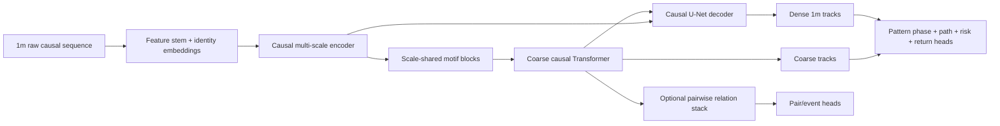

# AlphaTrade MarketGenome 技术方案报告

**版本**：v0.1  
**日期**：2026-07-13  
**状态**：研究设计 / 待实施  
**目标读者**：AlphaTrade 项目负责人、量化研究员、模型工程师、数据工程师、负责 K 线形态定义的领域专家  
**项目代号**：`MarketGenome`

---

## 0. 执行摘要

本报告提出一条新的 AlphaTrade 主线：不再把人工加工的多周期状态字段直接追加到短窗口收益预测器，而是按照 AlphaGenome 的完整研究范式，构建一个**严格因果、长序列、多尺度、密集多任务的市场序列到功能轨迹模型**。

核心研究假设是：

> M 头、W 底、头肩顶、头肩底、趋势、突破、失败突破、回踩、支撑阻力转换等 K 线形态，可以在 1 分钟、5 分钟、15 分钟、1 小时、日线乃至更长周期重复出现。它们不是“大周期专属结构”，而是在不同时间尺度上出现的同类时间序列模体（temporal motifs）。

因此，正确的 AlphaGenome 类比不是“给现有模型增加几个形态特征”，而是：

```text
原始长市场序列
→ 多尺度局部与长程表示
→ 每个时间位置的密集市场 tracks
→ 多任务联合训练
→ time-fold teachers 与 distillation
→ 合法 K 线扰动与 effect scoring
→ 从模型中识别跨尺度形态及其条件结果
```

本方案的可行性判断：

| 层面 | 判断 |
|---|---|
| 用 AlphaGenome 的研究范式建模 K 线 | 高可行性 |
| 学习跨周期同构形态及其形成阶段 | 中高可行性，但依赖高质量 ontology、dense tracks 与 synthetic gate |
| 稳定超过 rolling baseline | 未知，必须用严格样本外实验验证 |
| 最终形成扣成本可交易 alpha | 未知，不应在模型验证之前承诺 |

当前 M12 的负结果并不否定该方向。M12 已经证明数据合同、因果边界和训练链路可靠，但把 79 个 Chendage processed features 作为 dense per-minute features 加入现有短窗口 pinball 模型后，所有候选均未超过 8D common-row control；这说明的是**当前表示与训练目标不适合利用这类信息**，而不是技术形态不存在或不可学习。[AT-02][AT-03]

本方案建议保留 AlphaTrade M0-M12 已形成的 contract-first、schema、sweep、leaderboard、M9/M10/M11 评估体系，同时在新目录 `src/alphatrade/market_genome/` 中建立独立模型主线。第一阶段不追求交易收益，而是依次通过：

1. AlphaGenome code parity audit；
2. 多尺度 K 线形态 ontology；
3. synthetic multi-scale motif benchmark；
4. causal dense-track dataset；
5. long-context causal U-Net + Transformer；
6. learnability gate；
7. real-data multi-task pretraining；
8. teacher distillation；
9. market in-silico mutagenesis；
10. pattern-effect 与 alpha benchmark。

---

## 1. 背景与问题定义

### 1.1 AlphaTrade 当前真正遇到的问题

AlphaTrade 并不是“训练不动”。M0-M12 已经证明：

- JAX/GPU 训练、checkpoint、bundle、offline inference 可运行；
- target 为 raw log return，未发现漏做 inverse transform；
- M10/M11 的 calibration、baseline、IC/rank IC 与 schema gates 已建立；
- M12 Chendage data contract、common-row、truncated/mutated causality 均通过；
- 87D 数据能够真实进入 dataloader、模型、bundle 与 inference；
- 21/21 formal runs 已在 GPU 完成。

但模型质量仍不够：M12 formal run 中，8D common-row control 的 3-seed validation mean 为 `0.0012521362`，最好的 Chendage candidate `chg_core_no_m5` 为 `0.0013347069`，完整 `chg_core` 为 `0.0015268211`；所有候选均更差。M10/M11 风格评估中，base8 raw pinball 为 `0.0011936268`，rolling historical baseline 为 `0.0008602891`；校准后仍未稳定超过 rolling baseline。[AT-02][AT-03]

因此瓶颈已经从工程问题转为：

```text
任务定义
+ 输入表示
+ 监督密度
+ 形态阶段建模
+ 训练制度
+ 评价基准
```

### 1.2 为什么“增加 processed features”与“学习形态”不是一回事

M12 给现有模型增加的是 daily/H1/M5/minute behavior 的 processed numeric states，例如趋势状态、距支撑阻力、MACD 状态、量价行为等。它们有解释性，但存在三类信息损失：

1. **几何损失**：形态的 swing 序列、幅度比例、持续时间比例、颈线斜率和发展路径被压缩成若干静态字段；
2. **阶段损失**：同一形态从萌芽、发展、确认、回踩到失效的过程未被作为密集 track 学习；
3. **样本稀释**：形态事件相对全市场分钟样本稀疏，overall pinball 容易优先学习无条件分布。

新的 MarketGenome 主线要让模型直接观察长原始序列，在多个尺度上学习同类结构，并通过密集多任务监督获得可识别的形态表征。

---

## 2. 对 AlphaGenome 的代码级理解

### 2.1 AlphaGenome 的任务与训练制度

AlphaGenome 接收最长 1 Mb DNA 序列和 organism identity，同时预测人类 5,930 条或小鼠 1,128 条 genome tracks，覆盖 11 类输出，包括表达、转录起始、可及性、组蛋白修饰、转录因子结合、接触图和剪接等。[AG-01]

其关键不是某一个 layer，而是以下组合：

- 长上下文；
- 细粒度与粗粒度输出并存；
- 大量密集、多模态监督；
- U-Net 风格 encoder/decoder；
- coarse Transformer 处理长程依赖；
- sequence 与 pairwise 表示共同更新；
- organism-specific embeddings 与 heads；
- 4-fold pretraining；
- all-fold teachers；
- augmented / mutated input distillation；
- variant effect 与 in-silico mutagenesis；
- 对 target resolution、sequence length、modalities、teacher count 做系统 ablation。[AG-01][AG-02]

论文显示，1 Mb 训练与 1 Mb 推理通常获得最好结果；多模态联合学习、teacher ensemble 与 distillation 是显式实验变量，而不是未经验证的工程偏好。[AG-01]

### 2.2 官方代码中的 trunk

官方 `model.py` 的核心路径为：

```text
DNA one-hot
→ DnaEmbedder
→ 逐级 pooling + DownResBlock，得到 /128 表示和 skip connections
→ 9 层 TransformerTower，交替更新 sequence 与 pairwise representations
→ SequenceDecoder 逐级上采样并融合 skip connections
→ 1bp、128bp、pair embeddings
→ 多个 task-specific heads
```

`SequenceEncoder` 保存 `bin_size_1/2/4/8/16/32/64` 的中间表示并最终下采样到 `/128`；`TransformerTower` 在多个 block 中交替执行 `PairUpdateBlock`、由 pair 表示生成 attention bias、sequence MHA 和 MLP；decoder 再恢复到细粒度分辨率。[AG-02][AG-03]

官方 embeddings 明确包含：

- `embeddings_1bp`；
- `embeddings_128bp`；
- `embeddings_pair`（2,048bp resolution）。[AG-04]

### 2.3 多模态 heads 与目标尺度

官方 heads 包括 genome tracks、contact maps、splice-site classification、splice-site usage 和 splice junction。Genome track heads 可以在 1bp 和 128bp 等多个 resolution 输出，并按 organism 使用专门的线性权重、track metadata 和 target scaling。[AG-05]

官方实现对实验 target 做 track-mean normalization 和可选 squashing，并在 loss 中区分总量与位置分布。例如部分 track loss 同时包含 Poisson total-count 项和 multinomial positional 项。这一思想非常适合迁移到市场：**未来总波动幅度**与**未来路径在时间上的分布**应拆开学习，而不是只预测一个终点 return。[AG-05][AG-06]

### 2.4 pairwise representation 的意义

AlphaGenome 的 pairwise stack 不是单纯二维输出头。Sequence-to-pair 模块把 coarse sequence 表示转成 pair representation；pair 表示经过 row attention 和 MLP 更新，再生成 sequence attention bias，从而让成对关系反向影响 sequence 表示。[AG-03]

在 MarketGenome 中，初版不必强行定义“市场 contact map”真值，但可以保留一个可选 pair stack，用来表达：

- 两个时间块之间的结构关系；
- 某次前高/前低与当前价格位置的关系；
- 跨尺度 anchor 的对应；
- 不同品种之间的 lead-lag（后续阶段）。

pair head 的监督应延期到定义成熟之后，但 pair representation 可以先作为 architecture ablation。

### 2.5 augmentation、distillation 与 effect scoring

AlphaGenome pretraining 使用序列 shift 与 reverse complement；distillation 使用 augmented、mutationally perturbed inputs，让 student 模仿 frozen all-fold teacher ensemble。论文中的 ablation 表明，mutational perturbation 对部分 variant-effect 任务有帮助。[AG-01][AG-07]

市场不能使用时间反转作为等价增强，但可以建立合法的市场增强与扰动体系：

- 随机因果 crop/shift；
- 价格平移与尺度不变变换；
- 波动率尺度变换；
- time dilation/compression；
- 多空镜像（仅作为 ablation）；
- 局部 OHLC 合法扰动；
- 删除或改变成交量/OI 事件。

---

## 3. AlphaGenome 与 MarketGenome 的完整方法映射

| AlphaGenome | MarketGenome | 说明 |
|---|---|---|
| DNA base sequence | 最细基础周期的原始 K 线与流量序列 | MVP 以 1m 为 base resolution |
| 1 Mb context | 8K/16K/32K+ bars 长上下文 | 覆盖多个 session 与多尺度形态 |
| A/C/G/T channels | 归一化 OHLC 几何、return、volume、OI、session | 避免直接依赖绝对价格 |
| species identity | symbol / exchange / sector / contract / session identity | 解决不同品种语义不一致 |
| local motif | 局部 K 线组合、swing 与短形态 | 所有周期都可出现 |
| distal regulatory relation | 远距离前高前低、趋势段、关键位与当前结构关系 | 由 coarse Transformer / pair stack 建模 |
| 1bp embedding | 1m dense embedding | 对每个基础时间点输出 tracks |
| 128bp embedding | coarse temporal embedding | 例如 /64、/128 表示 |
| pair embedding | time-time / scale-time relation embedding | 初期可无监督，仅作 architecture ablation |
| genome tracks | 市场 tracks | return path、vol、range、MFE/MAE、pattern phase 等 |
| cell/tissue contexts | symbol、sector、session、regime contexts | heads 或 conditioning |
| splice-site/junction | swing anchors、neckline、breakout 与成对结构事件 | 事件/成对 head |
| 4-fold genome split | 4-fold purged time split | 再增加 held-out symbol/regime |
| all-fold teachers | all-time-fold teachers | 只在正式 pretraining 后实施 |
| reverse complement | 无直接等价物 | 多空镜像只能作 ablation |
| variant scoring | 合法 K 线结构 edit 的 effect scoring | 比较 reference/edit 输出差异 |
| ISM | market in-silico mutagenesis | 逐位置或结构参数扰动 |
| held-out genome regions | held-out time, symbol, regime | test 不参与任何阈值选择 |

### 3.1 “完整类比”的正确含义

完整类比不是逐行复制 DNA 模型，也不是宣称市场与基因完全同构。它意味着复制以下研究原则：

1. 从**原始长序列**学习，不依赖预先压缩的规则输出；
2. 用**多尺度表示**同时保留局部形态和远距离关系；
3. 对序列中大量位置进行**密集监督**；
4. 用多种 market modalities 共同训练共享 trunk；
5. 通过 folds、teachers、distillation 提升泛化；
6. 通过合法 perturbation 研究结构效应；
7. 先证明 track 与 pattern benchmark，再讨论交易结果。

### 3.2 必须做的因果化改造

AlphaGenome 可以利用目标位置左右的静态 DNA 上下文；MarketGenome 在时刻 `t` 只能使用 `<=t` 的信息。因此以下组件必须严格 causal：

- convolution padding；
- downsampling；
- attention mask；
- skip alignment；
- decoder；
- normalization statistics；
- resampling到标准周期的 bar close alignment；
- any pairwise feature。

每个正式模型必须通过 prefix invariance 和 mutated-future invariance tests。

---

## 4. 核心研究假设：跨周期同构形态

### 4.1 形态不是“大周期特征”

M 头、头肩顶、趋势等结构可以在任意时间周期形成。时间周期变化后，通常变化的是：

- 持续 bar 数；
- 绝对价格振幅；
- 波动率和噪声；
- 流动性与成交量分布；
- 形态可靠度和后续路径概率。

其拓扑和形成逻辑可以保持相似。因此模型需要学习：

```text
同一种 pattern family
+ 不同 scale
+ 不同 maturity/phase
+ 不同 market context
→ 不同条件结果分布
```

### 4.2 需要“scale equivariance”，而不是简单 resample

如果只显式生成 5m、15m、1h、日线输入，模型会依赖人工周期边界。MarketGenome 应同时使用：

1. 连续 power-of-two 内部尺度：`1/2/4/8/16/32/64/128/...`；
2. 标准交易周期 taps：`1m/5m/15m/30m/1h/4h/daily`；
3. scale-shared motif blocks；
4. scale embeddings，允许同构之外的尺度差异。

共享权重让同一个形态模板跨尺度复用；scale embedding 让模型学习“1m M 头”和“日线 M 头”的噪声和结果分布不同。

### 4.3 形态必须建模形成过程

不能只输出一个 `double_top=true`。每个 pattern family 应有生命周期 track：

```text
inactive
→ candidate
→ developing
→ mature
→ confirmed
→ retest/continuation
→ completed or invalidated
```

具体 phase 名称和 anchor 定义必须由领域专家冻结。Codex 只能把已批准 ontology 实现成 schema、detector、labeler 和 tests，不应自行发明交易规则。

---

## 5. MarketGenome 输入设计

### 5.1 基础时间分辨率

MVP 使用 1 分钟 bar 作为 base resolution。原因不是认为形态只存在于 1 分钟，而是要从最细统一序列中构造所有更高尺度表示。

后续可以扩展：

- tick / second microstructure trunk；
- daily-only long-history trunk；
- cross-asset trunk。

但第一版应先在 1m 数据上验证跨尺度模式可学性。

### 5.2 输入通道

建议第一版通道分为五组。

#### A. 价格几何

```text
log_return_1m
body / volatility_scale
upper_wick / volatility_scale
lower_wick / volatility_scale
range / volatility_scale
gap / volatility_scale
close_location_in_bar
```

#### B. 流量与持仓

```text
log1p(volume)
volume / past-only baseline
open_interest
open_interest_change
turnover or amount, if available
```

#### C. 时间与 session

```text
minute/session phase encoding
night/day session
minutes since session open
known session segment
holiday/roll proximity, when causally known
```

#### D. 合约与品种 identity

```text
symbol embedding
exchange embedding
sector/product cluster embedding
contract age
continuous-contract roll state
```

#### E. 缺失/可用性 masks

每个非稳定通道必须有明确 mask；mask 本身与数值通道分开，避免把填充值当真实信号。

### 5.3 不使用的输入

正式 MarketGenome trunk 不直接消费：

- 人工交易动作；
- A/B/C/D 评级；
- teacher trade outcome；
- future MFE/MAE；
- 人工复盘结论；
- 任何 test-period tuning 结果。

这些最多作为独立 benchmark 或 teacher target，不能成为 runtime input。

---

## 6. 长序列与多尺度架构

### 6.1 模型族

建议定义三个规模：

| 配置 | Context | Downsample | Coarse tokens | 用途 |
|---|---:|---:|---:|---|
| `mg_tiny` | 4,096 | /64 | 64 | 单 GPU synthetic 与 learnability |
| `mg_small` | 8,192 | /128 | 64 | 第一版真实数据 MVP |
| `mg_base` | 16,384 | /128 | 128 | 多 GPU或大显存阶段 |

更长上下文只有在 context ablation 证明有效后再扩展。

### 6.2 架构总览



### 6.3 Causal encoder

初版应使用 learned strided causal convolution 或经 ablation 验证的 causal pooling，而不是默认复制 DNA 模型的非因果/SAME 行为。

每个 stage 保存：

```text
scale_1
scale_2
scale_4
...
scale_128
```

并输出 skip connections。每个 stage 包含：

- causal convolution；
- residual path；
- RMSNorm/RMSBatchNorm；
- gating；
- optional dilated convolution。

### 6.4 Scale-shared motif block

这是 MarketGenome 相比现有 AlphaTrade 的关键新增模块。

对多个尺度的 feature maps：

1. 投影到统一 channel width；
2. 使用共享或部分共享的 motif block；
3. 加入 scale embedding；
4. 输出 pattern-sensitive embeddings；
5. 回写各尺度 trunk。

需要做三组 ablation：

```text
independent scale blocks
fully shared scale blocks
shared core + scale-specific adapters
```

### 6.5 Coarse Transformer

Transformer 只在 coarse tokens 上运行，从而以可控成本建模长程关系。必须使用 causal mask，并支持：

- relative temporal position；
- session boundaries；
- contract roll boundaries；
- optional time-gap encoding；
- logits soft cap；
- BF16 + FP32 accumulation。

### 6.6 Pairwise relation stack

第一阶段设置为可选 architecture flag：

```text
pair_stack.enabled = false by default
```

synthetic benchmark 通过后，再测试它是否帮助：

- 两个 swing anchor 的成对关系；
- 颈线与顶/肩的位置关系；
- 远距离支撑阻力；
- 不同时间块间的关系。

在定义可靠 pair target 前，不建立“盈利 contact map”之类未经验证的标签。

### 6.7 Decoder 与 dense outputs

decoder 恢复到 1m 分辨率，并在 1m 及若干 coarse resolutions 输出 tracks。与当前 AlphaTrade 只读取 `x[:, -1, :]` 不同，MarketGenome 必须对 chunk 内多个有效位置计算 loss。

---

## 7. Market tracks 设计

### 7.1 设计原则

AlphaGenome 的优势来自数千条 dense tracks。MarketGenome 也必须从“一个窗口四个 return 标签”升级为“每个时间点多个 market tracks”。

tracks 分为以下 modalities。

### 7.2 未来路径 tracks

对 horizon 集合 `H`，在每个有效时间点预测：

```text
future cumulative return profile
terminal return distribution
future high/low excursion path
future realized volatility
future range
future volume and OI change
```

`future cumulative return profile` 是从 `t+1` 到 `t+H` 的路径，不只是终点值。

### 7.3 风险与 first-passage tracks

```text
MFE
MAE
time_to_MFE
time_to_MAE
up_barrier_first
down_barrier_first
time_to_barrier
timeout
```

barrier 必须按 past-only volatility scale 或结构 risk 定义，参数只在 train/validation 冻结。

### 7.4 结构与形态 tracks

每个标准尺度都可以有：

```text
swing_high / swing_low probability
trend phase and strength
range/compression state
breakout / failed-breakout phase
double-top / double-bottom phase
head-and-shoulders / inverse phase
support-resistance state
pattern maturity
pattern invalidation probability
```

形态 label 必须区分：

- **online causal phase**：只由 `<=t` 的 prefix 定义；
- **retrospective completion label**：允许未来作为 target，用于判断当时的 candidate 是否最终完成；
- **outcome label**：确认后未来路径的结果。

三者不能混为同一字段。

### 7.5 自监督 tracks

为增加监督密度，可加入：

```text
masked historical feature reconstruction
next-block latent prediction
multi-scale consistency
contrastive scale alignment
```

自监督任务不能替代收益和 pattern benchmark，但可以改善 trunk 表示。

### 7.6 输出 resolution

初版建议：

| Track modality | 1m | /8或/16 | /64或/128 |
|---|---:|---:|---:|
| short-horizon path | 是 | 可选 | 否 |
| return/vol/range | 是 | 是 | 是 |
| pattern phase | 是 | 是 | 是 |
| long-horizon regime | 否 | 是 | 是 |
| pair/event relation | 否 | 否 | 可选 |

---

## 8. 多尺度形态 ontology

### 8.1 Ontology 的角色

Ontology 不是为了把人工规则硬编码成交易系统，而是为了：

1. 建立统一术语；
2. 定义 pattern family 与 formation phase；
3. 生成 synthetic ground truth；
4. 建立真实数据 gold set；
5. 评估模型是否学到形态，而非仅靠 return 指标猜测。

### 8.2 Pattern object schema

每个形态实例建议包含：

```yaml
pattern_id:
family:
side:
scale_id:
base_timeframe:
start_eob:
current_eob:
phase:
anchors:
  - role:
    eob:
    normalized_price:
geometry:
  amplitude_ratios:
  duration_ratios:
  slopes:
  symmetry:
context:
  prior_trend:
  volatility_regime:
  volume_oi_context:
confirmation:
invalidation:
maturity_score:
label_provenance:
assumption_ids:
```

### 8.3 第一版 pattern families

第一版建议覆盖：

- 趋势及趋势形成/衰减；
- 双顶/双底；
- 头肩顶/头肩底；
- 突破/失败突破/回踩；
- 区间与支撑阻力转换。

每个 family 的最终几何定义、phase transition、确认和失效必须由领域专家 review。系统设计只规定 schema 和测试，不替领域专家决定“什么是真正的头肩顶”。

### 8.4 多尺度一致性

同一 pattern family 在不同 scale 上共享：

- 拓扑角色；
- phase 顺序；
- anchor 关系；
- 价格/时间归一化方式。

允许尺度特异性：

- 噪声容忍度；
- 最小持续时间；
- volume/OI 辅助强度；
- outcome 分布；
- 交易成本影响。

---

## 9. Synthetic multi-scale benchmark

### 9.1 为什么必须先做 synthetic

如果架构不能在已知 ground truth 的数据上识别同一种形态跨尺度出现，就没有理由相信它能在真实市场噪声中学习。

synthetic benchmark 不证明 alpha，只验证：

- 形态 representation 是否正确；
- scale sharing 是否有效；
- phase head 是否能学习；
- causal model 是否能在形成过程中做预测；
- perturbation scoring 是否反映结构变化。

### 9.2 生成器要求

生成器应支持：

- 多个 base length；
- 不同 pattern duration；
- 不同 amplitude；
- trend/range/heteroskedastic noise；
- volume/OI context；
- overlapping patterns；
- partial/incomplete patterns；
- hard negatives；
- invalidation cases。

所有 OHLC 必须合法：

```text
low <= min(open, close) <= max(open, close) <= high
volume >= 0
open_interest >= 0
```

### 9.3 Synthetic gate

进入真实数据训练前，至少要求：

- held-out scale 上 pattern-family macro-F1 达到预设阈值；
- phase prediction 明显优于 majority/random；
- 在价格平移、尺度缩放和合理 time dilation 后结果稳定；
- future mutation 不改变 prefix predictions；
- one-batch overfit 成功；
- small TCN、MarketGenome、non-shared baseline 均有可比报告。

阈值必须在 MG2 contract 中冻结，不能训练后再修改。

---

## 10. Loss 与 target parameterization

### 10.1 Baseline-residual return head

rolling historical quantile 当前是强 baseline。MarketGenome 不应从随机输出重新学习整个无条件分布，而应：

\[
Q_{h,q}(t) = Q^{rolling}_{h,q}(t) + s_h \cdot \Delta Q_{h,q}(t)
\]

其中：

- `Q_rolling` 严格使用 past-only 数据；
- `s_h` 由 train split 的 target scale 冻结；
- `ΔQ` 初始化为 0；
- 对 residual 加正则，避免无意义破坏 baseline。

这样模型初始性能等于 rolling baseline，训练目标是学习 conditional effect。

### 10.2 Path total + profile 分解

借鉴 AlphaGenome total-count + positional-profile 思路，市场未来路径可拆成：

```text
total_abs_movement
signed terminal effect
normalized temporal profile
```

例如：

- total movement 使用 Huber/log-normal/Poisson-like positive loss；
- normalized absolute movement profile 使用 cross-entropy/KL；
- signed path 使用 robust regression；
- terminal quantile 使用 residual pinball/CRPS。

### 10.3 Pattern losses

```text
pattern family: class-balanced focal / CE
phase: ordinal or transition-aware CE
anchor heatmap: BCE / focal
completion outcome: Brier / CE
maturity: regression or ordinal loss
```

稀疏事件必须使用 mask、class weighting 和 matched hard negatives，不能让模型通过永远输出 `inactive` 获得高准确率。

### 10.4 Multi-task weighting

第一版使用显式、可审计的 fixed weights；随后比较：

- uncertainty weighting；
- GradNorm；
- loss normalization by target variance；
- task sampling。

任何动态 weighting 必须记录实际权重轨迹。

### 10.5 Target scaling

所有连续 targets 必须包含：

```text
unit
formula
train-only scaler
inverse transform
clipping/winsorization
horizon/scale-specific statistics
```

禁止再次出现“配置声明和实际训练不一致”。resolved config 是唯一 source of truth。

---

## 11. 数据构建与 split

### 11.1 Long-sequence chunk

数据单位从 60-bar window 改为长 chunk：

```text
symbol
chunk_start_eob
chunk_end_eob
base features [L, F]
identity/context
track targets by modality and resolution
target masks
fold id
```

chunk 可以重叠，但 split 必须防止 horizon overlap 和同一事件泄漏。

### 11.2 Four-fold time split

类比 AlphaGenome 4-fold：

- 使用四个 purged time folds；
- 每个 fold 的 train/val/test 在时间上隔离；
- horizon-aware purge；
- contract-roll-aware embargo；
- 最终 test 不参与 ontology threshold、loss weight 或 architecture 选择。

另外增加：

- held-out symbol benchmark；
- held-out sector benchmark；
- held-out volatility regime benchmark。

### 11.3 Gold set 与 weak labels

形态 labels 采用三层：

1. deterministic candidate generator；
2. domain-expert reviewed gold set；
3. weak labels for full corpus。

报告必须区分：

```text
rule-derived
human-reviewed
synthetic
auto-model-assisted
```

不允许把 model-assisted labels 当独立 test ground truth。

---

## 12. 训练制度

### 12.1 Stage 0：learnability

必须先通过：

- one-batch overfit；
- synthetic signal recovery；
- shuffled-label control；
- simple-model ladder；
- context-length ablation；
- pooling/downsampling ablation。

### 12.2 Stage 1：fold-specific pretraining

每个 time fold 训练独立模型，联合预测 market tracks。先训练 `mg_tiny`，再进入 `mg_small`。

### 12.3 Stage 2：all-fold teachers

在 folds 与目标稳定之后，训练 all-fold teacher models。Teacher 不用于正式 out-of-fold benchmark，只用于 distillation。

### 12.4 Stage 3：distillation

student 模仿 teacher ensemble 的 dense tracks，并使用合法 augmentation 与 local perturbation。比较：

```text
1 teacher
4 teachers
8 teachers
```

第一版不需要复制 AlphaGenome 64 teachers 的规模。

### 12.5 Optimizer 与 schedule

必须真正实现并记录：

- warmup；
- cosine or schedule ablation；
- weight decay；
- gradient clipping；
- mixed precision；
- EMA（可选）；
- gradient accumulation；
- checkpoint selection rule。

YAML、resolved config、train metrics 和实际 optimizer 必须一致。

---

## 13. 合法市场扰动与 effect scoring

### 13.1 目的

Market ISM 的目标不是制造收益，而是回答：

> 改变一段 K 线结构的某个局部组成后，模型对 pattern phase、future path、barrier probability 和 return distribution 的预测如何变化？

### 13.2 合法 edits

示例包括：

- 提高/降低第二个顶；
- 改变头部相对肩部高度；
- 改变右肩高度和持续时间；
- 改变颈线斜率；
- 删除或增强某次放量；
- 改变 OI 行为；
- 缩短/拉长结构；
- 把成功突破改为失败突破；
- 替换单根 candle，但保持 OHLC 合法。

### 13.3 评估

检查：

- model output delta 是否方向合理；
- sensitivity 是否集中于关键 anchors；
- 同类 edit 跨 scale 是否一致；
- effect 是否在 held-out patterns 上稳定；
- 是否只依赖最后几根 bar。

---

## 14. Benchmark 体系

### 14.1 Track benchmark

```text
return: pinball / CRPS / calibration
path: correlation / profile divergence
vol/range: MAE / rank correlation
barrier: AUC / AUPRC / Brier
MFE/MAE: MAE / quantile coverage
```

### 14.2 Pattern benchmark

```text
family classification macro-F1 / AUPRC
phase prediction macro-F1
onset timing error
confirmation timing error
anchor localization
scale transfer
partial-pattern detection
invalidation detection
```

### 14.3 Pattern-effect benchmark

比较：

```text
pattern events
matched controls
prior-trend-only baseline
breakout-only baseline
simple rule detector
linear/GBDT/TCN baselines
MarketGenome
```

匹配条件包括：symbol、session、volatility、prior trend、month、liquidity、pattern duration。

### 14.4 Alpha benchmark

保留 M10/M11 指标：

- zero baseline；
- rolling historical quantile；
- linear/ridge/TCN；
- pinball/CRPS；
- coverage；
- IC/rank IC；
- direction hit rate；
- cost sanity；
- turnover；
- drawdown。

Backtest 在最后阶段仍是 diagnostic，除非 execution engine 单独通过验证。

---

## 15. Promotion gates

### Gate A：工程与因果

- schema/semantic pass；
- prefix invariance；
- future mutation invariance；
- train-only normalization；
- deterministic resolved config；
- no test tuning。

### Gate B：Synthetic learnability

- multi-scale motif recovery；
- held-out scale generalization；
- phase detection；
- hard-negative discrimination；
- simple-model comparison。

### Gate C：Real track prediction

- multi-task model优于 single-task；
- long context优于 short context；
- track metrics在多个 folds 稳定；
- pattern heads 在 held-out time/symbol 泛化。

### Gate D：Baseline-aware alpha

- return head在 common rows 上至少不劣于 rolling baseline；
- residual model提供稳定增量；
- coverage不依赖纯 post-hoc rescue；
- IC/rank IC跨 fold 稳定；
- 不依赖单个 symbol/horizon。

### Gate E：Effect interpretation

- perturbation sensitivity与 pattern anchors 对齐；
- 合法 edits 产生稳定、可解释的输出变化；
- 不出现明显 shortcut。

未通过任何前置 gate，不进入更昂贵阶段。

---

## 16. 计算与工程路线

### 16.1 单 GPU MVP

建议从 `mg_tiny` 开始：

```yaml
context_length: 4096
base_resolution: 1m
downsample: 64
coarse_tokens: 64
d_model: 128-256
transformer_layers: 4-6
pair_stack: false
precision: bf16
batch_size: 1-4
gradient_accumulation: enabled
```

在 16GB GPU 上是否满足目标吞吐，需要 MG4 实测，不提前承诺。

### 16.2 扩展路线

```text
Tier 1: single GPU, synthetic + mg_tiny
Tier 2: larger-memory GPU / 2-4 GPUs, mg_small
Tier 3: multi-device sequence parallelism, mg_base+
```

只有 context ablation 证明更长输入有效，才投入多设备扩展。

### 16.3 Repository 结构

```text
src/alphatrade/market_genome/
  config.py
  schemas.py
  inputs.py
  causal_layers.py
  encoder.py
  motif_blocks.py
  pair_stack.py
  transformer.py
  decoder.py
  embeddings.py
  heads/
  losses/
  ontology/
  synthetic/
  datasets/
  training/
  distillation/
  perturbation/
  evaluation/

configs/market_genome/
docs/alphaTrade/market_genome/
tests/market_genome/
```

旧 `src/alphatrade/core/` 保持兼容，不原地重写。

---

## 17. 主要风险与缓解

| 风险 | 影响 | 缓解 |
|---|---|---|
| Pattern ontology 主观 | 标签不稳定、循环验证 | domain expert freeze、assumption IDs、gold set、一致性统计 |
| 稀疏事件 | 模型学会永远 inactive | class balance、event sampling、hard negatives、AUPRC |
| 多任务梯度冲突 | trunk 被非 alpha 任务主导 | task ablation、gradient diagnostics、固定与动态 weighting 对比 |
| 长序列计算成本 | 训练不可承受 | coarse Transformer、remat、chunking、先 tiny 后扩展 |
| 非平稳 | 历史有效未来失效 | time folds、regime holdout、rolling reevaluation |
| 多重试验 | 假阳性 | hypothesis registry、frozen test、FDR/多轮 holdout |
| Pattern label 使用未来 | 概念混淆 | 明确 online phase、retrospective completion、outcome 三套字段 |
| Teacher 自我确认 | student 复制 teacher 偏差 | teacher OOF benchmark、independent gold set、simple baseline |
| 交易收益过早驱动 | 过拟合 backtest | 先 track/pattern gates，最后才 alpha/cost |

---

## 18. 最终建议

本方向值得立项，但必须按研究工程项目推进，而不是一次性“把 AlphaGenome 改成 K 线版”。

优先顺序：

```text
MG0 AlphaGenome parity audit
→ MG1 pattern ontology
→ MG2 synthetic scale benchmark
→ MG3 dense market tracks
→ MG4 causal backbone
→ MG5 learnability gate
→ MG6 real multi-task pretraining
→ MG7 teachers/distillation
→ MG8 perturbation/effect benchmark
→ MG9 alpha evaluation
```

最关键的 go/no-go 点是：

1. synthetic multi-scale pattern recovery 是否成立；
2. real pattern benchmark 是否优于 simple detectors；
3. multi-task long-context trunk 是否在 held-out time/symbol 上泛化；
4. residual return head 是否稳定超过 rolling baseline。

只有四项都出现正证据，才值得扩大模型和算力。

---

## 19. 事实依据与引用

### AlphaGenome 官方来源

- **[AG-01]** Avsec et al., *Advancing regulatory variant effect prediction with AlphaGenome*, Nature 649, 1206-1218 (2026).  
  https://www.nature.com/articles/s41586-025-10014-0
- **[AG-02]** Google DeepMind, `alphagenome_research`, `model/model.py`.  
  https://github.com/google-deepmind/alphagenome_research/blob/main/src/alphagenome_research/model/model.py
- **[AG-03]** Google DeepMind, `model/attention.py`.  
  https://github.com/google-deepmind/alphagenome_research/blob/main/src/alphagenome_research/model/attention.py
- **[AG-04]** Google DeepMind, `model/embeddings.py`.  
  https://github.com/google-deepmind/alphagenome_research/blob/main/src/alphagenome_research/model/embeddings.py
- **[AG-05]** Google DeepMind, `model/heads.py`.  
  https://github.com/google-deepmind/alphagenome_research/blob/main/src/alphagenome_research/model/heads.py
- **[AG-06]** Google DeepMind, `model/losses.py`.  
  https://github.com/google-deepmind/alphagenome_research/blob/main/src/alphagenome_research/model/losses.py
- **[AG-07]** Google DeepMind, `model/augmentation.py`.  
  https://github.com/google-deepmind/alphagenome_research/blob/main/src/alphagenome_research/model/augmentation.py
- **[AG-08]** Google DeepMind, AlphaGenome Research repository.  
  https://github.com/google-deepmind/alphagenome_research

### AlphaTrade 项目依据

- **[AT-01]** AlphaTrade repository branch `feature/m12-chendage-features`.  
  https://github.com/fogdance/alphagenome_research/tree/feature/m12-chendage-features
- **[AT-02]** `M12_CHG_FORMAL_DECISION_MEMO.md`, run root `/data/alphatrade/runs/m12_chg_formal5_20260626_parallel`.
- **[AT-03]** `m12_regression_report.json/md`, `m12_leaderboard.json/md`, `m12_formal_decision_summary.json`.
- **[AT-04]** `m11_target_scale_audit.json/md`, `m11_calibration_comparison.json/md`, `m11_model_quality_validation.json/md`.

